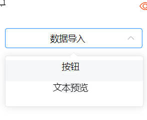
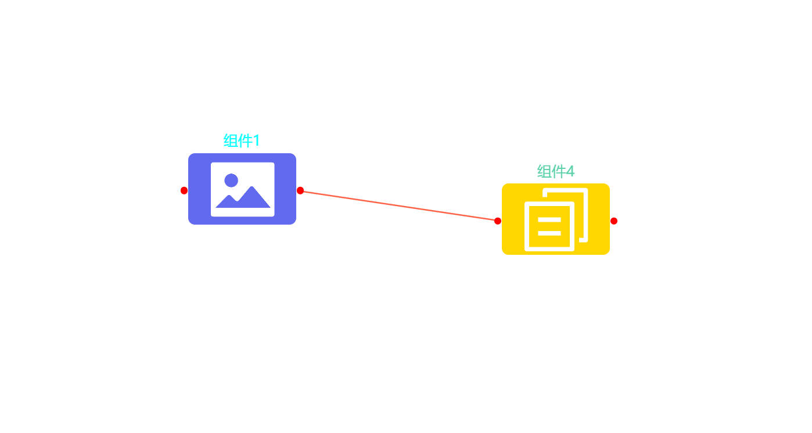
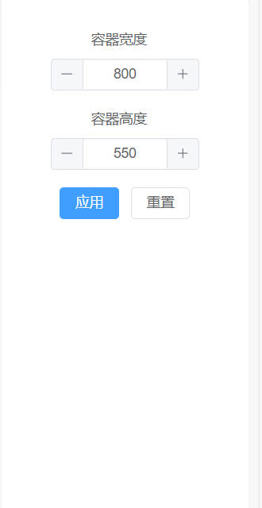
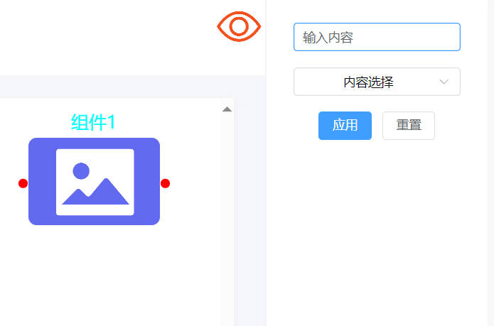
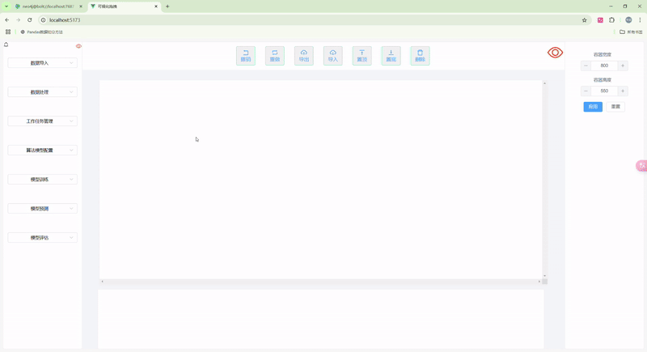

# **这是一个前端低代码可拖拽式页面，可根据自己组件内容，添加布置信息**
## 🔧 手动环境部署
### **您需要先安装Node.js，请在官网安装 18.3 或更高版本的 Node.js**
```
https://nodejs.org/zh-cn
```
### **1.项目建立**
**Step 1**：安装项目所需要的所有依赖包，默认使用npm install安装根目录下所有pakeage
**Step 2**：输入命令
```sh
npm install
```
### **2.Vite**
Vite 是独立于 Vue.js 的工具，适用于多种前端框架，包括 React、Svelte、Vue.js，甚至是纯 JavaScript 项目。本项目需要部署vue架构后安装Vite
```sh
npm install @vitejs/plugin-vue
```
### **2.编译运行**

```sh
npm run dev
```
### **3.环境配置打包**
```sh
npm run build
```
## 🐳具体功能介绍
- 本项目是的所有组件均放在vue-visual-editor-main\packages中
### 1. 左侧物料栏区域

-左侧属性栏是一个分层设计的选择界面，主要用于管理不同模块的功能配置。

#### **操作说明**：
- 使用下拉框选择需要的组件并拖拽到目标区域。
- 显示实时的组件预览。
### 2. 顶部控制栏区域

-顶部控制栏提供了一组操作按钮，用于对拖拽进入工作区的组件进行管理和控制。这些操作包括撤销、重做、导入、导出、置顶、置底以及删除功能。
### 3. 中间画布区域

-画布区域是应用的核心工作区，用于可视化组件的添加、排列和连接。用户可以通过拖拽操作将组件放置到画布中，并通过连线建立组件之间的逻辑关系。
-每个组件以矩形框的形式呈现，用直观的图标表示组件。连接线用于表示组件之间的依赖或逻辑关系，通过拖拽连接点动态生成。
### 4. 右侧属性栏区域

-右侧属性栏是应用的设置区域，主要用于调整画布或组件的属性。根据不同状态，右侧属性栏会显示不同的内容：
-在未选中任何组件时，右侧属性栏用于设置画布的全局属性：画布的宽度（如默认值为 `800px`），画布的高度（如默认值为 `550px`）
-当用户选中画布中的组件时，右侧属性栏会根据组件的类型显示相应的可配置属性。

### 4. 整体页面展示



